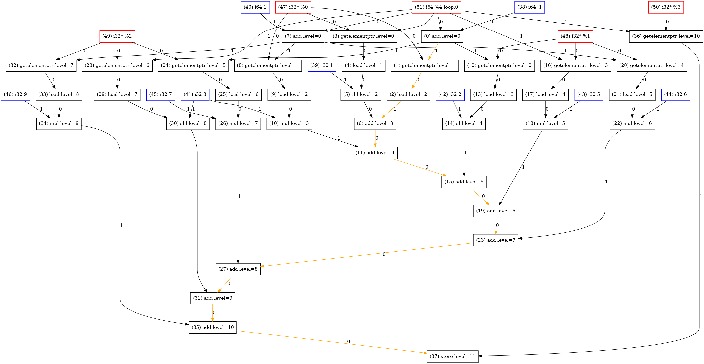
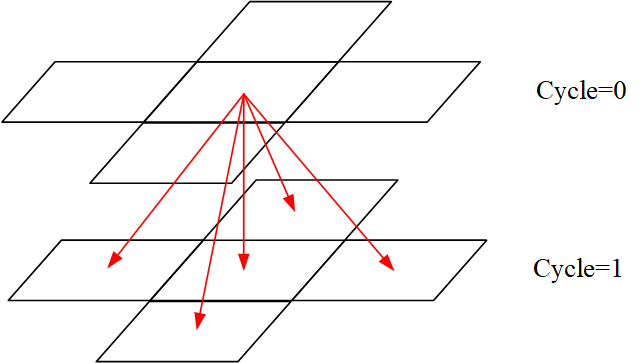
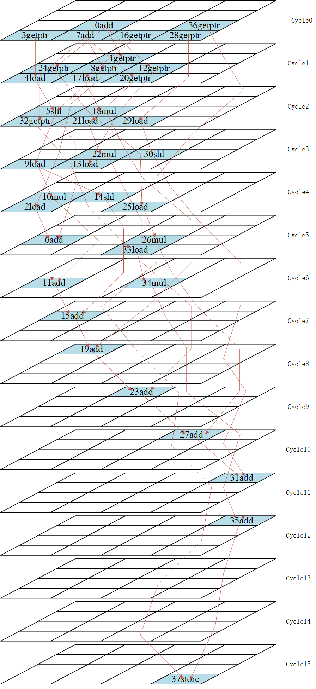
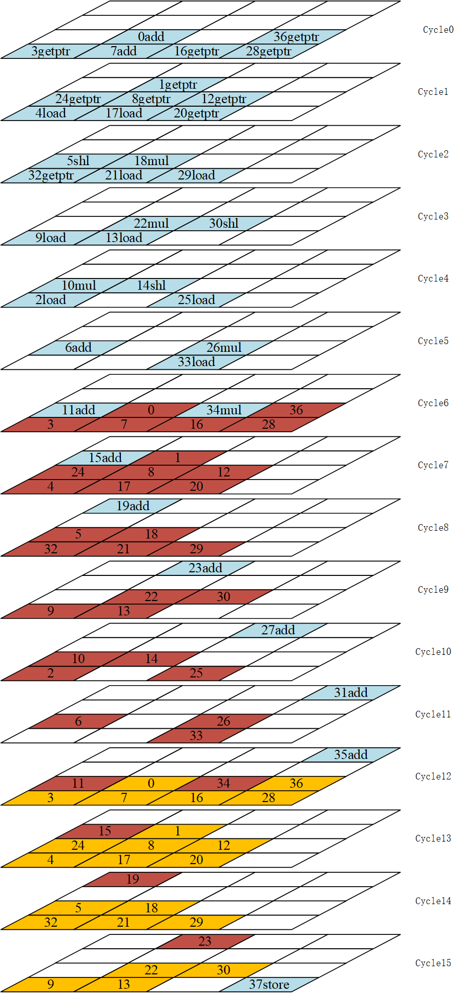
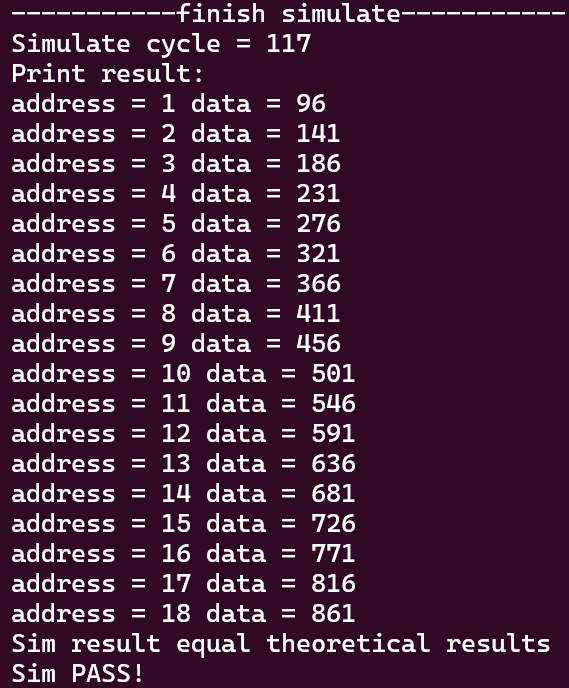

# Brief description

**HI-CGRA-Generator:** Use Chisel to generator and simulate CGRA hardware.  
**HI-CGRA-Mapper:** Use llvm to generator DFG for kernel program, map DFG node to MRRG, generate the bitstram.  
**HI-CGRA-Emu:** A C++ clock accurate CGRA Simulator.  
**HI-CGRA-Workbench:** A workbench where compile the kernel and use HI-CGRA-Mapper to generate DFG and bitstream.  

Except for HI-CGRA-Generator, which is currently under development, all others have already formed a demo,and detailed documentation work will begin after HI-CGRA-Generator demo is formed.

# Project configuration

Ubuntu 22.04

## HI-CGRA-Generator

1.  install dependency.
```
sudo apt-get install make curl openjdk-11-jdk
echo "deb https://repo.scala-sbt.org/scalasbt/debian all main" | sudo tee /etc/apt/sources.list.d/sbt.list
echo "deb https://repo.scala-sbt.org/scalasbt/debian /" | sudo tee /etc/apt/sources.list.d/sbt_old.list
curl -sL "https://keyserver.ubuntu.com/pks/lookup?op=get&search=0x2EE0EA64E40A89B84B2DF73499E82A75642AC823" | sudo apt-key add
sudo apt-get update
sudo apt-get install sbt
```
[mill]: https://com-lihaoyi.github.io/mill/ 

## HI-CGRA-Mapper

1. install dependency
```
sudo apt-get install clang-12 make build-essential llvm llvm-12-dev graphviz bison flex
```
2. add MAPPER\_HOME to ~/.bashrc

## HI-CGRA-Workbench

1. add CGRA\_WORKBENCH to ~/.bashrc  

## HI-CGRA-Emu

1. install dependency
```
sudo apt-get install make build-essential bison flex libncurses-dev
```
2. add CGRA\_EMU\_HOME to ~/.bashrc

**For more information, please read the README.md file in this four folders**

# Demo

## Compile conv3 demo

You can read the code of conv3 kernel in "./HI-CGRA-Workbench/kernels/conv3/conv3.c".
```c
void kernel(int *line1,int *line2,int *line3,int *result, long k){
	int kernel[3][3]= {{1,2,3},{4,5,6},{7,8,9}};
	result[k] = line1[k-1]*kernel[0][0] + line1[k]*kernel[0][1] + line1[k+1]*kernel[0][2]
	+line2[k-1]*kernel[1][0] + line2[k]*kernel[1][1] + line2[k+1]*kernel[1][2]
	+line3[k-1]*kernel[2][0] + line3[k]*kernel[2][1] + line3[k+1]*kernel[2][2];
}
```

You need to compile the HI-CGRA-Mapper first, in this demo we use defconfig.
```shell
cd ./HI-CGRA-Mapper
make defconfig
make
```

Compile the conv3 demo in HI-CGRA-Workbench.
```shell
cd ./HI-CGRA-Workbench
make KERNEL=conv3
```

The above command first use clang to compile conv3.c and generate kernel.bc, and then uses CGRA-Mapper to generate bitstreams and dataflow graphs.  
You can read LLVM IR by reading the kernel.ll file in "./HI-CGRA-Workbench/kernels/conv3/build".
```llvm
define dso_local void @kernel(i32* nocapture readonly %0, i32* nocapture readonly %1, i32* nocapture readonly %2, i32* nocapture %3, i64 %4) local_unnamed_addr #1 {
  %6 = add nsw i64 %4, -1
  %7 = getelementptr inbounds i32, i32* %0, i64 %6
  %8 = load i32, i32* %7, align 4, !tbaa !2
  %9 = getelementptr inbounds i32, i32* %0, i64 %4
  %10 = load i32, i32* %9, align 4, !tbaa !2
  %11 = shl nsw i32 %10, 1
  %12 = add nsw i32 %11, %8
  %13 = add nsw i64 %4, 1
  %14 = getelementptr inbounds i32, i32* %0, i64 %13
  %15 = load i32, i32* %14, align 4, !tbaa !2
  %16 = mul nsw i32 %15, 3
  %17 = add nsw i32 %12, %16
  %18 = getelementptr inbounds i32, i32* %1, i64 %6
  %19 = load i32, i32* %18, align 4, !tbaa !2
  %20 = shl nsw i32 %19, 2
  %21 = add nsw i32 %17, %20
  %22 = getelementptr inbounds i32, i32* %1, i64 %4
  %23 = load i32, i32* %22, align 4, !tbaa !2
  %24 = mul nsw i32 %23, 5
  %25 = add nsw i32 %21, %24
  %26 = getelementptr inbounds i32, i32* %1, i64 %13
  %27 = load i32, i32* %26, align 4, !tbaa !2
  %28 = mul nsw i32 %27, 6
  %29 = add nsw i32 %25, %28
  %30 = getelementptr inbounds i32, i32* %2, i64 %6
  %31 = load i32, i32* %30, align 4, !tbaa !2
  %32 = mul nsw i32 %31, 7
  %33 = add nsw i32 %29, %32
  %34 = getelementptr inbounds i32, i32* %2, i64 %4
  %35 = load i32, i32* %34, align 4, !tbaa !2
  %36 = shl nsw i32 %35, 3
  %37 = add nsw i32 %33, %36
  %38 = getelementptr inbounds i32, i32* %2, i64 %13
  %39 = load i32, i32* %38, align 4, !tbaa !2
  %40 = mul nsw i32 %39, 9
  %41 = add nsw i32 %37, %40
  %42 = getelementptr inbounds i32, i32* %3, i64 %4
  store i32 %41, i32* %42, align 4, !tbaa !2
  ret void
}
```

If successful, you will find the following files in "./HI-CGRA-Workbench/outputs/conv3\_0"  
1. bitstream.bin: the CGRA config bitstream.
2. conv3\_0.png and kernel.dot: the DFG of the conv3 kernel function.

conv3\_0.png is displayed below
<div style="text-align:center;">
    
</div>

* Each black DFGnode in DFG is an instruction in LLVM IR. 
* Each blue DFGNode in DFG is a const in instruction. 
* Each read DFGNode in DFG is an argument of the kernel function.The parameters of the function include the loop number i labeled "loop:0" in the graph, as well as other parameters such as line1, line2, line3 and result  which are also labeled "%0","%1","%2" and "%3" in the graph.
* The number 0 or 1 on the DFGEdge indicates which operand this is.0 represents the first operand, 1 represents the second operand.
* The Orange DFGEdges marks the longest path in the DFG.
* We give a level to each DFGNode,the DFGNode with lower level executes earlier and is mapped earlier.

After generating the DFG,HI-CGRA-Mapper map the DFG to MRRG, a simple MRRG is shown in the following figure.
<div style="text-align:center;">
    
</div>

This MRRG shows the resources that CGRAs of five PEs can use within two clock cycles.Each block in this figure represents the PE of a certain clock cycle, which can perform an operation this cycle and transfer data to neighbor PEs in next clock cycle.The red Edge in this figure indicates the transmission of date.The vertical downward arrow indicates that the data is saved in PE for one clock cycle.

This demo's CGRA Hardware is shown in this following figure.MRRG for this CGRA is bigger.
```
  the default CGRA
  --------------------------------> x
  col0  col1  col2  col3
  |----| |----| |----| |----|
  |    |-|    |-|    |-|    | row3
  |----| |----| |----| |----|
    |      |      |      |
  |----| |----| |----| |----|
  |    |-|    |-|    |-|    | row2
  |----| |----| |----| |----|
    |      |      |      |
  |----| |----| |----| |----|
  | 4  |-|....|-|    |-|    | row1   ^ y
  |----| |----| |----| |----|        |
    |      |      |      |           |
  |----| |----| |----| |----|        |
  | 0  |-| 1  |-| 2  |-| 3  | row0   |
  |----| |----| |----| |----|        |
    |      |      |      |
  |----| |----| |----| |----|
  |MeM0| |MeM1| |Mem2| |MeM3| 
  |----| |----| |----| |----|
```
In this demo,CGRA is 4x4 and only PE 0,1,2,3 can access Datamem. In this demo we constrain load and store opts which access the first row of image to PE0 ,sencond row to PE1, third row to PE2 and result to PE3.You can see this constraint in "./HI-CGRA-Workbench/kernel/conv3/mapconstraint.json".This constraint means that a specific memory access operation will only be mapped to specific PEs.

The demo conv3's DFG mapped in the MRRG is shown in the following figure.The DFGNode ID and operation name in the PE indicate which DFGNode occupies the PE in a certain clock cycle.Operands of DFGNodes which comes from the calculation results of other DFGNodes are represented by edges in this figure.Operands of DFGNodes which comes from const or function param is put in PE's constmem or control regs,this is not show in this figure.
<div style="text-align:center;">
    
</div>

HI-CGRA-Mapper successfully maps with II = 6.We need 6 clock cycles to calculate the kernel function for one time.This is shown in following figure.In our conv3 application,we need to run this kernel function for many times.
<div style="text-align:center;">
    
</div>

## Run conv3 demo in HI-CGRA-Emu

You need to compile the HI-CGRA-Emu first, in this demo we use defconfig.
```shell
cd ./HI-CGRA-Emu
make defconfig
make
```

You need to copy the bitstream.bin to "./HI-CGRA-Emu".(A correct bitstream.bit of conv3 have been saved in ./HI-CGRA-Emu. If you want to use the bitstream.bin compiled by yourself,cp it from HI-CGRA-Workbench,else jump this step)
```shell
cp ../HI-CGRA-Workbench/outputs/conv3_0/bitstream.bin ./
```

Then you can run the Emu to simulate.
```shell
make run
```
When run a applicate in HI-CGRA-Emu,you need config the CGRA using the bitstream.bin and load data to DataMems first.You can read code in HI-CGRA-Emu/src/main.c. Code of HI-CGRA-Emu is simple now, it's also a good way to understand our hardware's behavior.

You can see the result shown in following figure.
<div style="text-align:center;">
    
</div>

# TODO
